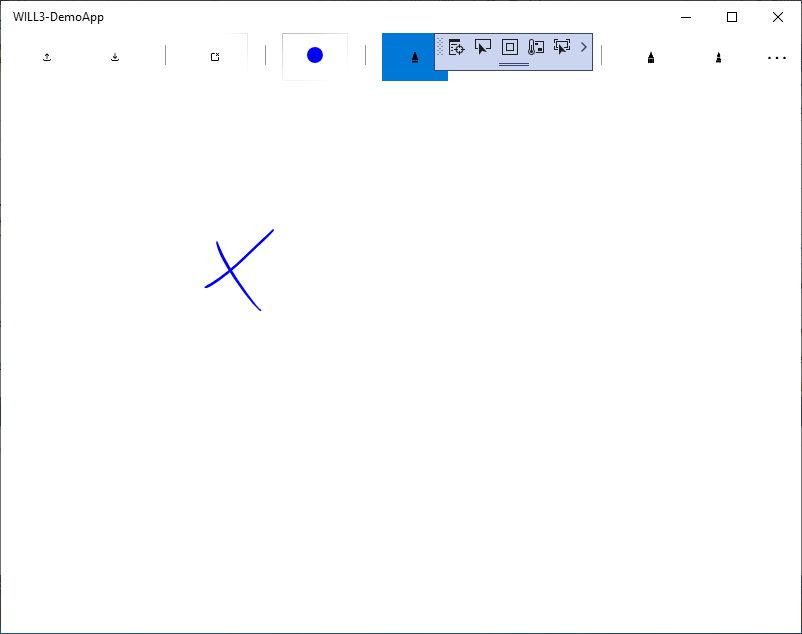

# Getting Started 

## Windows 10 UWP Development Environment

The WILL SDK for Ink requires Windows 10 with Visual Studio 2019 or above.
A sample application has been provided for the Universal Windows Platform (UWP).

## Download the SDK

Download the SDK from https://developer.wacom.com/developer-dashboard

* Login using your Wacom ID
* Select **Downloads for ink**
* Download **WILL SDK for ink for Windows 10 (UWP/WPF) (version 3.0)**
* Accept the End User License Agreement to use the SDK

The downloaded Zip file contains the SDK.

## SDK License

The SDK does not require a license key. Use of the SDK is subject to the End User License Agreement. 

## Using the WILL SDK

The SDK contains the NuGet packages required by the application code.
> Ultimately the packages will be available in the public NuGet.org Gallery provided for the .NET community.
> Until they are in place the same result can be achieved by using a local copy:

•	copy the SDK *NuGets* folder alongside the sample project code
•	follow the instructions below to add the NugGet packages to the project references
    

## Sample Application

Build the application in Visual Studio 2019.

- open the demo application WILL3-DemoApp-UWP.sln solution file
- if prompted, select Developer Mode in Visual Studio
- to compile the application you will need to add the NuGet packages to the project. One way is as follows:
    - copy the sdk folder containing NuGet packages to a local folder
      e.g. *WILL NuGets* 
    - right-click the project in Solution Explorer
    - Select *Manage NuGet Packages...* 
      Wacom packages may be listed as unavailable. To resolve:
    - Select Settings (gear wheel) - displays the Options dialog
    - Select New (+)
    - this will set new source Name: to 'Package Source' by default.
      Change to *Wacom*
    - click the browse button ...
    - navigate to the *WILL NuGets* folder
    - click Update
    - on return to NuGet Package Manager change Package Source: to the newly created source folder (e.g. *Wacom*)
      Wacom packages should now be shown as available (if necessary select Install):
        Wacom.Ink
        Wacom.Ink.Rendering.UWP

- build the project as Debug x86 or Debug x64
- run the program to display the main window
- by selecting different options in the menu, the rendering options can be explored.
- Options are included to clear the display and to save, or read a WILL Universal ink file

## API Reference

Having installed the NuGet packages the API can be viewed through IntelliSense or Object Browser in Visual Studio.

----

        

