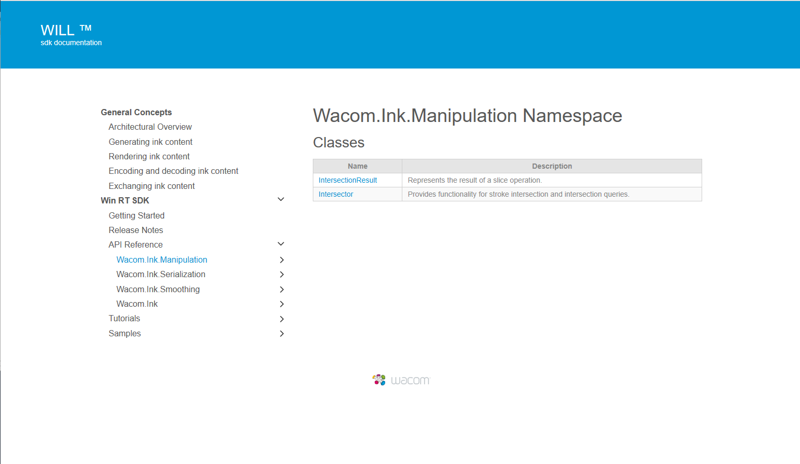
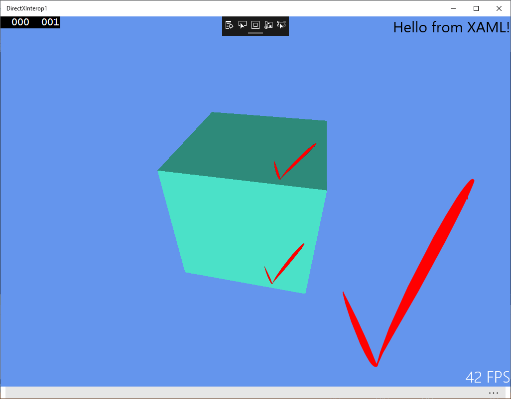

# Getting Started 

## Windows 10 UWP Development Environment

The WILL SDK for Ink requires Windows 10 with Visual Studio 2017 or above.
Tutorial samples have been provided for the Universal Windows Platform (UWP).

## Download the SDK

Download the SDK from https://developer.wacom.com/developer-dashboard

* Login using your Wacom ID
* Select **Downloads for ink**
* Download **WILL SDK for Windows 10 (UWP)**
* Accept the End User License Agreement to use the SDK

The downloaded Zip file contains the SDK with documentation.


## SDK License

The SDK is free of charge and does not need a license.

## Using the WILL SDK

To use the SDK first install the Visual Studio .vsix extension:

    Sdk\Will.Ink.vsix

Double-click in File Explorer and follow the installation instructions.
    

## Tutorials

Tutorials demonstrate how to use WILL SDK in Windows Store applications. 
The tutorials are divided into parts that demonstrate various aspects and features of the SDK. 
The following tutorials are provided:

* [Tutorial 1: Drawing with Pointing Devices](Samples/Tutorials/Tutorial_01/README.md)
* [Tutorial 2: Stroke Model and Serialization](Samples/Tutorials/Tutorial_02/README.md)
* [Tutorial 3: Erasing Strokes](Samples/Tutorials/Tutorial_03/README.md)
* [Tutorial 4: Selecting Strokes](Samples/Tutorials/Tutorial_04/README.md)
* [Tutorial 5: Working with Rasters](Samples/Tutorials/Tutorial_05/README.md)
* [Tutorial 6: Pen Id](Samples/Tutorials/Tutorial_06/README.md)

The sample code in the tutorials is written in C#. 
Each tutorial has an associated project which can be compiled and run using Visual Studio 2013.

The projects are created with Visual Studio 2013 using the following template in the New Project dialog:

```Templates > Visual C# > Store Apps > Windows Apps > Blank App (Windows)```


## API Reference

In the downloaded SDK open this file in a browser:

`documentation\index.html`

The page gives access to the API Reference section:



---

## Sample Application

Build the supplied project in Visual Studio.
These instructions document one experience using Visual Studio 2017:

* In Visual Studio 2017, Open Solution… Samples\DirectXInterop1.sln  
* If prompted, install C++ Universal Windows Platform tools
* If prompted, select 'Retarget Solution' in Solution Explorer and accept the default Windows SDK versions
* Verify the References defined in the project are valid, particularly WILL Ink.
* If the reference to WILL Ink is an older version:
    * Remove the existing reference
    * Add reference...Universal Windows...Extensions...WILL Ink 2.1
* Select CPU type x64
* Set DirectXInterop1 as the startup project: right-click the project in Solution Explorer ... Set as Startup Project
* Build project
* Run to display the startup window.
* Draw with the mouse to see live rendering:




----

        


